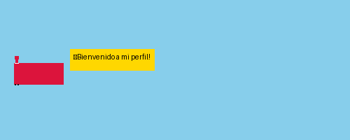

<p align="center">
  
</p>

<p align="center">
  
</p>

# 👋 ¡Hola! Soy **SAMUEL SALAZAR OSPINA**

💻 Desarrollador **Full-Stack** apasionado por crear aplicaciones escalables y limpias.  
🚀 Amante del aprendizaje continuo, resolución de problemas y proyectos de impacto.  
⚡ Fun fact: el café ☕ es mi framework secreto.

---

## 🛠️ Tech Stack
<p align="center">
  
  
  
  
  <br/>
  
  
  
  <br/>
  
  
  
  
</p>

---

## 📊 Estadísticas
<p align="center">
  
  
</p>

<p align="center">
  
</p>

---

<p align="center">
  
</p>

---

## 🌍 Conéctemos
<p align="center">
  <a href="https://www.linkedin.com/in/samuel-salazar-ospina-419899245">
    
  </a>
  <a href="mailto:samuelsala24@gmail.com">
    
  </a>
</p>

---

## ✨ Un poco de diversión
```text
> npm start life
✔ Coffee loaded
✔ Code compiled
✔ Creativity running
✔ Errors fixed
🚀 Project deployed!
